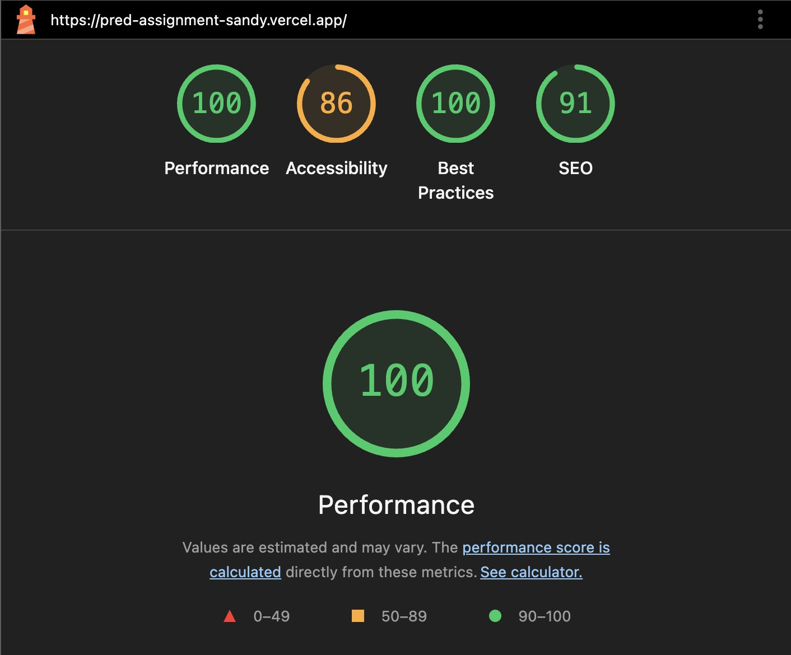

# PRED Sports Trading Platform

A real-time sports trading platform built with React, TypeScript, and Tailwind CSS. Features a dynamic orderbook, live price simulation, and comprehensive trading functionality.

## 🚀 Features

### Lighthouse Report


### Core Trading Features
- **Real-time Order Management**: Place market and limit orders with instant execution
- **Dynamic Orderbook**: Live orderbook with depth visualization showing liquidity distribution
- **Position Management**: Track open positions with real-time P&L calculations
- **Trade History**: Complete audit trail of all executed trades
- **Balance Management**: Real-time balance updates with trade fee calculations

### UI/UX Features
- **Responsive Design**: Optimized for mobile trading with fixed dimensions (412px × 880px)
- **Smooth Animations**: Framer Motion animations for order placement, cancellations, and transitions
- **Accessibility**: ARIA roles, keyboard navigation, and high contrast text colors
- **IBM Plex Sans Typography**: Professional trading interface font
- **Real-time Updates**: Live price feeds and order status updates

### Data Persistence
- **localStorage Integration**: All trading data persists across browser sessions
- **State Management**: Zustand stores for efficient state management
- **Data Restoration**: Automatic restoration of orders, positions, and trade history on app restart

## 🛠️ Setup Instructions

### Prerequisites
- Node.js (v16 or higher)
- npm or yarn package manager

### Installation

1. **Clone the repository**
   ```bash
   git clone <repository-url>
   cd pred-sports-trader
   ```

2. **Install dependencies**
   ```bash
   npm install
   ```

3. **Start the development server**
   ```bash
   npm start
   ```

4. **Open your browser**
   Navigate to `http://localhost:3000`

### Build for Production
```bash
npm run build
```

## 🏗️ Architecture

### Technology Stack
- **Frontend**: React 18 with TypeScript
- **Styling**: Tailwind CSS with custom components
- **State Management**: Zustand stores
- **Animations**: Framer Motion
- **Data Persistence**: localStorage with custom sync hooks

### Project Structure
```
src/
├── components/
│   ├── common/           # Reusable UI components
│   │   └── PredHeader.tsx # Secondary header
│   └── trade/            # Trading-specific components
│       ├── TradeScreen.tsx    # Main trading interface
│       ├── TradeControls.tsx  # Order placement controls
│       ├── OrderBook.tsx      # Live orderbook display
│       ├── MarketCard.tsx     # Market information card
│       └── BottomTabs.tsx     # Orders, positions, history tabs
├── stores/               # Zustand state stores
│   ├── useMarketStore.ts     # Price feed and market data
│   ├── useOrderbookStore.ts  # Orders, positions, trade history
│   └── useBalanceStore.ts    # Balance and P&L management
├── hooks/                # Custom React hooks
│   ├── useTradeEngine.ts     # Trading logic and order execution
│   ├── useLocalStorageSync.ts # Data persistence
│   └── index.ts              # Hook exports
├── types/                # TypeScript type definitions
│   └── trade.ts              # Trading-related types
└── App.tsx               # Main application component
```

## 📊 Mock Data Simulation

### Price Feed Simulation
- **Real-time Updates**: Price changes every 2 seconds
- **Realistic Movement**: ±2% random price fluctuations
- **Price History**: Maintains last 100 price points
- **Cents Denomination**: All prices displayed in cents (e.g., 34¢)

### Orderbook Generation
- **Dynamic Depth**: 5 levels on each side (buy/sell)
- **Realistic Quantities**: Random shares between 100-2000
- **Depth Visualization**: Horizontal progress bars showing liquidity distribution
- **Cumulative Volume**: Background extends based on total volume at each price level

### Trading Simulation
- **Market Orders**: Execute immediately at current mid price
- **Limit Orders**: Execute when price crosses the limit
- **Trade Fees**: 1% fee on all transactions
- **Balance Management**: Real-time balance updates
- **Position Tracking**: Automatic P&L calculations

## 🔧 Implementation Decisions

### State Management Strategy
**Zustand Stores**: Chosen over Redux for simplicity and performance
- **useMarketStore**: Manages price feed and market data
- **useOrderbookStore**: Handles orders, positions, and trade history
- **useBalanceStore**: Manages user balance and P&L

### Data Persistence Approach
**localStorage with Custom Sync**: Ensures data survives browser restarts
- **Automatic Sync**: All state changes automatically saved
- **Selective Restoration**: Only pending orders restored (not filled/cancelled)
- **Sample Data**: Initial sample data for testing when no existing data

### UI/UX Design Decisions
**Mobile-First Trading Interface**:
- **Fixed Dimensions**: 412px × 880px container for consistent experience
- **Scrollable Sections**: Tab content scrollable to handle varying data amounts
- **Real-time Feedback**: Immediate visual feedback for all user actions
- **Professional Typography**: IBM Plex Sans for trading interface

### Trading Logic Implementation
**Realistic Trading Engine**:
- **Price Conversion**: Proper cents-to-dollars conversion for calculations
- **Order Execution**: Market orders execute immediately, limit orders wait for price
- **Position Management**: Automatic position creation, updates, and closure
- **Fee Calculation**: 1% fee applied to all trades

### Performance Optimizations
- **Memoization**: Orderbook data memoized to prevent unnecessary re-renders
- **Efficient Updates**: Zustand's selective updates minimize re-renders
- **Animation Optimization**: Framer Motion optimizations for smooth performance
- **Debounced Updates**: Price updates throttled to prevent excessive re-renders

## 🎯 Key Features Explained

### Dynamic Orderbook
The orderbook displays real-time market depth with:
- **Sell Orders**: Red background extending horizontally based on cumulative volume
- **Buy Orders**: Green background extending horizontally based on cumulative volume
- **Depth Visualization**: Background length represents total liquidity at each price level
- **Real-time Updates**: Orderbook regenerates with each price change

### Order Management
Comprehensive order handling with:
- **Market Orders**: Execute immediately at current market price
- **Limit Orders**: Wait for price to cross the specified limit
- **Order Status**: Pending → Filled/Cancelled with visual progress indicators
- **Automatic Cleanup**: Filled orders removed from open orders after 1 second

### Position Tracking
Real-time position management featuring:
- **Automatic Creation**: Positions created when orders are filled
- **P&L Calculation**: Real-time profit/loss in dollars (converted from cents)
- **Position Updates**: Existing positions updated with new trades
- **Position Closure**: Automatic closure when selling entire position

### Trade History
Complete audit trail including:
- **Timestamp Format**: YYYY-MM-DD HH:mm:ss format for all timestamps
- **Trade Details**: Price, size, fees, and execution time
- **Order Type Display**: Limit/Buy (green) or Limit/Sell (red) with color coding
- **Persistent Storage**: All trades saved to localStorage
